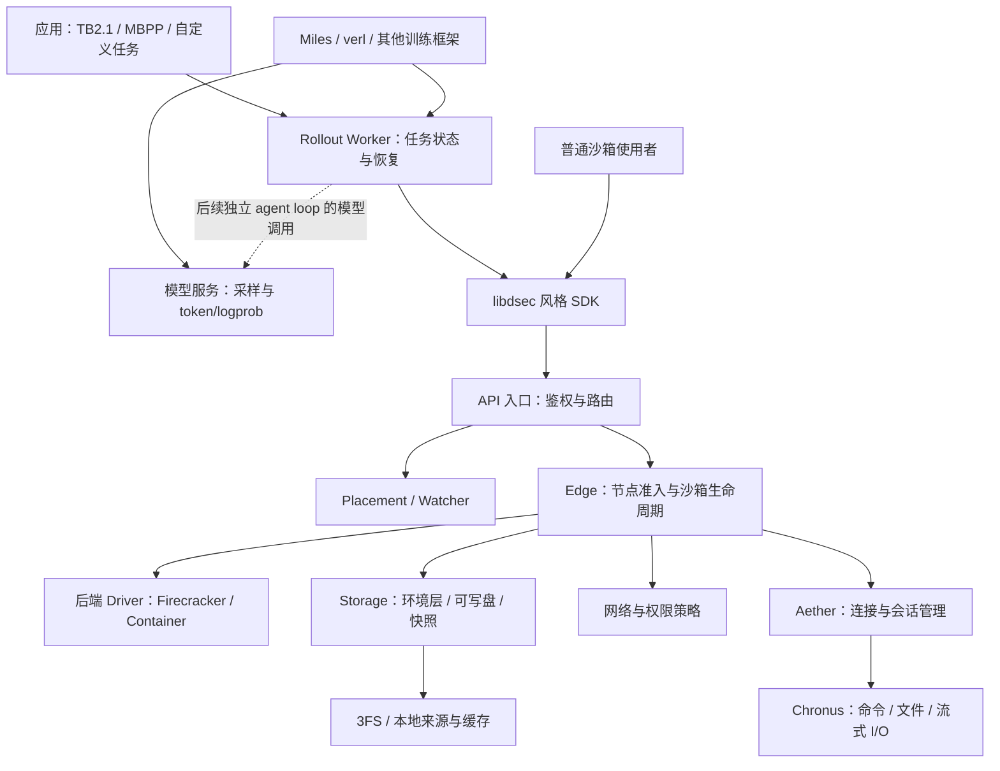

# DSec 模块化重构设计

状态：设计已确认，R0/R1 已实施；R2 评分插件节点已实施，其余 R2 与 R3 待完成。日期：2026-10-08。
代码基线：`7f70524187e61e13f123c7999098858cf3411bd5`。

## 1. 目标与范围

目标是通用的 DSec 弹性沙箱系统。底层按论文的机制和职责组织，顶层提供稳定的
沙箱 SDK、可恢复的 rollout 服务和可选应用接入。TB2.1、MBPP 是使用者，不决定核心模型。

系统资源管理范围为沙箱：guest RAM、VMM、环境层与可写盘缓存、共享存储服务，
以及创建、暂停、快照、恢复和回收所需资源。模型权重、KV cache、优化器、训练/推理
GPU 显存和模型 offload 归外部框架管理。节点准入可观察外部负载造成的资源压力，
但不卸载模型或调整推理服务配置；worker 的策略请求接口只调用外部模型服务。

本轮先整理模块、依赖与状态所有权，保留已验证行为；明确缺失能力的实现位置和验收条件。
不把重构与增加全部生产能力合并，不改写 Rust 存储组件，不迁入 RL 算法或 GPU 内存补丁。
目录调整通过不代表论文机制已经复现。

论文给出的运行路径包含 libdsec、控制面以及 edge → aether → chronus；存储、内存、CPU
与暂停恢复有各自机制。以[论文 §3、§5、§6、§7](https://arxiv.org/html/2609.22978)为设计依据，
公开描述不足以确认的线协议不宣称兼容。本项目保持 libdsec 风格调用语义，独立定义版本化协议。

## 2. 逻辑架构



图是目标逻辑架构。虚线表示尚未完整实现的训练生命周期解耦，不是已上线功能。
FnCall 将来走单独执行路径；当前不提供。完整 VM、分布式 IAM/placement/watcher 也不冒充已实现。

**模块不等于服务进程。** 首个部署仍是单机：API 路由与 Edge 可以同进程，placement
只有一个候选节点，worker 独立运行。保持请求入口和职责边界，以后再拆服务。
普通沙箱操作无需经过 rollout worker；需要 episode 管理的应用才使用它。

## 3. 顶层模块

采用一个 `dsec` Python 包，先保留现有发行包名称和 CLI。八个核心模块如下。

| 模块 | 职责 | 禁止承担的职责 |
| --- | --- | --- |
| `contracts` | Spec、ID、能力、错误、结果、协议版本和恢复状态 | 启动进程、读宿主资源、导入任务插件 |
| `sdk` | 薄客户端、沙箱句柄、请求关联、attach/query、libdsec 风格参数 | 启动 Docker/VMM、挂载磁盘、管理 sudo |
| `control` | 请求入口、授权边界、节点路由、placement 与 watcher 接口 | 保存第二份沙箱执行状态、执行 guest 命令 |
| `runtime` | Edge、生命周期、节点准入、后端驱动、会话、隔离、ready 池 | TB2 评分、模型解析、训练算法 |
| `storage` | 环境清单、分层、来源、缓存、块设备、快照与发布 | 驱动 rollout、分配 CPU、操作训练显存 |
| `rollout` | episode、动作与对话日志、任务插件调用、评分证据、恢复 | GRPO/GAE、模型特有解析、直接调用 VMM |
| `observability` | 事件与指标定义、采样、统计口径、Prometheus 导出 | 决定生命周期、把采样异常解释为任务失败 |
| `host` | 部署配置、依赖检查、安装计划、权限 helper、服务组合 | 在普通 SDK 调用中修改宿主全局配置 |

建议目录：

```text
src/dsec/
  contracts/       sandbox.py  environment.py  execution.py  protocol.py
  sdk/             client.py  sandbox.py  rollout.py  transport.py
  control/         api.py  routing.py  placement.py  watcher.py  authorization.py
  runtime/
    edge.py  registry.py  lifecycle.py  admission.py  resources.py  pool.py
    backends/      firecracker.py  container.py
    sessions/      channel.py  dispatcher.py
    isolation/     network.py  policy.py
  storage/
    catalog.py  layers.py  sources.py  cache.py  devices.py
    snapshots.py  publication.py  integrity.py
  rollout/         worker.py  episodes.py  actions.py  dialogue.py  evaluation.py
  observability/   events.py  meters.py  prometheus.py
  host/            configuration.py  doctor.py  install.py  privileged_helper.py
native/            guest_agent/（现有 C 实现，随后演进 aether/chronus）
integrations/      miles/  verl/（可选依赖与薄适配器）
apps/              tb21/  mbpp/（任务、数据准备、评分器、示例配置）
tests/             unit/  contracts/  integration/  acceptance/  packaging/
```

这是职责分组，不要求一次创建所有文件。暂未实现的 IAM 等能力在设计中保留边界，
不增加空服务、假的成功响应或无用抽象。每个实现只保留一个正式位置。

## 4. 底层机制的约束

以下是本项目的实现约束；当前状态依据代码和[路线图](../../ROADMAP.md)，不是目标能力清单的完成声明。

| 领域 | 目标实现与约束 | 当前需要处理的差距 |
| --- | --- | --- |
| 环境组合 | 显式区分 base、workspace、toolkit；不可变只读层共享，实例写入私有层；离线合并保留删除语义 | 不再让 `tb2-*` ID 决定核心存储行为；合并策略进入通用发布流程 |
| 按需存储 | 可选 local/3FS 来源；元数据与数据的布局能力显式声明；读取粒度、缓存与实际远端读取可追踪 | 不把本地全量预置描述为远端按需验证；3FS 本机部署不等于分布式验收 |
| microVM 磁盘 | 只读 EROFS 层与 OverlayBD＋ublk 可写 ext4 盘分别建模；需要 Docker data-root 时提供独立可写盘 | 现有存储组件继续复用；不把 FUSE 单盘组合设为唯一正式路径 |
| 内存 | DAX 用于适合共享的只读层；DAMON/FPR 是另一种回收策略；按设备和内核能力验证组合 | 当前 DAX 本地 backing 限制明确暴露；不能把两个 VM 的验证扩展为所有配置 |
| CPU | LS/BE 调度策略属于 runtime resource policy，记录逻辑 CPU/SMT 和实际应用状态 | 现有容器验证不能代表 VMM QoS 已完成 |
| 暂停恢复 | microVM 的暂停检查点与终止 VMM 分开记录；恢复继续原身份。容器冻结与内存卸载分别声明能力 | 不把 Docker pause 当作内存卸载已完成 |
| 环境发布 | `pack_diff` 发布磁盘增量；经过构建身份隔离、残留清理、完整性检查后成为新环境 | 现有磁盘 COW 是基础；prepared-state fork 不替代完整发布流程 |
| 会话执行 | Edge 管资源；aether 管连接与 session；chronus 管 session 内操作 | 当前 `guest_agent.c` 是单连接命令原型，尚非完整多会话、流式实现 |
| 安全 | Edge 通过受限 helper 应用实例策略；文件/socket 保护与出网策略分别建模 | netns 不等于完整 eBPF/AppArmor；宿主容器路径只保留可信开发/对照定位 |

特别区分两类 FUSE：3FS 客户端使用 FUSE，与自建的 EROFS 多层呈现/转发实现不是同一组件。
不能仅因使用或移除 FUSE，就判断是否与论文对齐。

ready 池、内存基线分叉和本地代理属于工程扩展，保留为显式选项。普通创建、池命中与
基线分叉分别统计；不把池中就绪实例的领取时间作为冷启动时间。

## 5. 状态所有权与依赖规则

| 状态 | 唯一负责模块 | 其他模块的权限 |
| --- | --- | --- |
| 沙箱生命周期、TTL、VMM 身份、网络/磁盘句柄、节点资源租约 | Runtime Edge | 查询或提交命令，不直接修改 registry |
| 不可变环境与快照对象、内容摘要、依赖、存储引用 | Storage | Edge 持有租约；停止后确认释放；回收由 Storage 根据引用和租约决定 |
| rollout、step/action ID、对话、任务预算、评分及证据 | Rollout Worker | SDK/训练框架通过协议读取与提交 |
| token/logprob、模型权重、优化器、原生训练样本 | 训练框架；将来的持久策略记录由明确的轨迹存储接口承接 | Worker 可保留原始响应及引用，不用文本伪造 token/logprob |
| 节点健康、负载和 placement 视图 | Control 的派生视图 | 从 Edge 重建，不作为沙箱是否存在的事实源 |
| 项目权限及配额（后续） | Control authorization | Edge 仍须做本地准入；权限与余量不能互相替代 |
| 监控样本与聚合指标 | Observability | 可失效或重建，不作为动作是否执行的证据 |

节点 CPU/内存/磁盘/网络的物理资源账本最终由 Edge 管；worker 保留作业并发/API 限额。
现有 `WorkScheduler` 的节点预留迁入该账本，过渡期间只保留一个预留路径，避免两个服务
分别扣除同一份内存。API 额度的部署共享范围必须明确，不能每个 worker 各算一份全局额度。

依赖规则：

- `contracts` 不依赖其他项目模块；`sdk` 只依赖 contracts 和客户端传输。
- control、runtime、storage、rollout 通过 contracts 中的接口或消息交互，不导入彼此的具体驱动。
- 后端不管理 episode，storage 不导入 runtime；Edge 用组合方式连接两者。
- 任务与训练集成依赖核心；核心不依赖 `apps`、Miles、verl、OpenEnv 或 benchmark 特例。
- host 作为服务组合入口注入实现，不被 SDK 或 contracts 导入；监控接收事实，策略另有明确接口。

## 6. 关键接口与执行流程

### 6.1 接口

`SandboxSpec` 表达 backend、environment digest、资源限制、TTL、网络策略、初始身份和
storage/memory/QoS policy。`EnvironmentManifest` 表达层角色、顺序、格式、依赖摘要和
验证要求。`FrameworkProfile` 暂作兼容配置入口，逐步转换为这些通用对象；不再用实验名
`e3_mixed` 或任务名前缀表达内核能力。

`Capabilities` 至少区分 command、persistent session、streaming、file I/O、pause、
memory offload、disk snapshot、memory restore、prepared fork、pack_diff、DAX 和 QoS。
能力结果包含不支持的原因，并校验组合；不能只列一组与当前环境无关的布尔值。

后端 Driver 提供 launch、inspect、freeze、checkpoint、restore、terminate 等运行原语；
命令执行属于 SessionChannel。Storage 提供 prepare、create_writable、checkpoint_disk、
publish_diff、release 等接口。具体系统调用留在各实现内，不传入 TB2 任务路径。

### 6.2 创建和执行

1. SDK 提交稳定 request ID 和 SandboxSpec，由 API 路由至 Edge。
2. Edge 校验能力与当前资源，持久记录创建意图，取得资源/存储/网络句柄，启动后端。
3. 会话通道就绪并核对身份后才返回 READY；失败按已取得资源逆序补偿并记录未决项。
4. exec 带 sandbox/session/action ID 经入口路由。接收、完成和结果落盘有独立状态。
5. 调用方断线只说明结果未知；查询或对账后处理，不自动重放有副作用的命令。

UNKNOWN 是动作结果状态，不是健康检查立即销毁实例的理由。健康检查使用独立控制连接
或保留容量，避免长命令占满连接池后误判。命令、RPC、episode、verifier 的超时分别配置。
输出采集上限、模型反馈截断和原始证据保留也分别配置。

### 6.3 暂停、分叉与发布

- 同一 episode 暂停/恢复保留身份、对话和已完成动作；状态可恢复后再确认完成。
- 准备态分叉产生新 sandbox/rollout ID、私有写入和独立历史；共享只读基线及引用。
- `pack_diff` 输出新环境的磁盘状态，不带旧会话、任务答案、worker 日志或模型上下文。
- stop 可重复调用；资源实际释放前保留租约和清理进度，不先宣告成功或永久漏占资源。

跨进程恢复必须依赖版本化 journal 和实际进程/设备身份核对；不能根据一个 PID 或旧
目录名就操作宿主进程。一般副作用不承诺任意故障下 exactly-once，保持未知状态和证据。

### 6.4 任务与 RL

TaskAdapter 负责 instruction、准备要求、动作解释和 verifier；Worker 负责持久推进及评分
记录；TrainerAdapter 负责模型模板、采样、原生 token/logprob 与训练样本转换。GRPO 分组身份
由训练框架保留，未知或失败 slot 不通过压缩数组替换成其他任务的样本。

现有 reset/step/evaluate/stop 入口和[反馈协议](AGENT_ENVIRONMENT_CONTRACT.md)继续有效。
MBPP 的评分回执与 TB2 的 worker 评分路径逐步接到同一证据接口，但保留原奖励语义。
任务未通过、预算耗尽、评分器故障、动作 UNKNOWN 分开记录；infra error 不伪装成模型零分。

短期仍允许训练框架驱动 agent loop。完整论文式解耦作为独立里程碑：worker 与 agent sandbox
承接运行状态，通过可重连的策略接口请求推理，训练进程退出后可继续或安全暂停。
仅持久保存 shell 日志不能宣称已完成该能力；缺失旧 TITO 的 episode 不进入训练更新。

## 7. 现有代码迁移位置

| 当前文件或组件 | 目标位置与必要拆分 |
| --- | --- |
| `sandbox_client.py`、`libdsec_compat.py` | sdk；容器启动和 journal 管理从客户端移至 Edge |
| `scheduled_dsec.py`、`rollout_client.py` | sdk 的 rollout 客户端；不导入服务端 scheduler 实现 |
| `sandbox_sdk.py`、`durable_manager.py` | runtime edge/lifecycle/registry/pool；组合替代管理器继承耦合 |
| `sandboxd.py` | control 入口及 host 服务组合；不再绑定 TB2 verifier |
| `microvm.py`、`container_backend.py`、容器 supervisor/broker | runtime backends；共享生命周期约束、保留后端差异 |
| `network_namespace.py`、权限 helper、`egress_proxy.py` | runtime isolation 与 host 管理端；策略与安装分开 |
| catalog、OverlayBD/ublk client、共享层、artifact publisher/integrity | storage；统一对象引用与发布流程 |
| `work_scheduler.py`、`admission_guard.py`、`work_journal.py` | runtime admission/resource 账本与 rollout 作业/API 限额拆分 |
| `rollout_workerd.py`、`rollout_store.py`、`agent_environment.py` | rollout 与 contracts；shell 格式化单独模块；任务分支移出 worker |
| resource meter/monitor、shared service monitor | observability；保留实例/共享服务/节点的不同统计边界 |
| `tb2_*` 与 adapters 内 TB2 清单和 verifier | apps/tb21；通过插件注册，不由核心按 ID 猜测任务类型 |
| Miles adapters、OpenEnv 兼容入口 | 可选 integrations；通用任务契约留核心，框架细节移出 |
| `dsec_host.py`、service admin、安装模板 | host；CLI 薄入口调用正式模块，不复制业务逻辑 |

旧顶层 import 在过渡期保留薄转发与弃用说明，禁止新旧两套实现并存。对安装入口、配置格式、
journal schema、环境摘要、已有实例路径分别做兼容检查；不能靠重新创建所有实例掩盖恢复回归。
权限 helper 的升级单独出安装计划，不借重构修改宿主 Docker、Grafana 或全局网络。

## 8. 分阶段实施与验收

| 阶段 | 交付 | 通过条件 |
| --- | --- | --- |
| R0：契约冻结 | 本设计、现有 API/CLI/schema 清单、模块依赖基线、恢复和安全不变量 | 审阅确认；可区分机械迁移与行为变化 |
| R1：模块搬迁 | 先 contracts/storage，再 runtime/host，随后 sdk/control/rollout；移动已有实现，保留兼容 shim | 当前 CI、发行归档、旧 import 和入口通过；核心不导入 benchmark/训练依赖 |
| R2：职责收敛 | 薄 SDK、统一 Edge 生命周期/节点账本、任务插件、明确 session/storage 接口 | 容器路径不再由 SDK 管宿主；无双重资源预留；UNKNOWN 和重启恢复契约通过 |
| R3：真实回归 | Linux 沙箱生命周期、存储与并发回归；TB2.1/MBPP 接入检查；短 GRPO 接口验收 | 独立写入、恢复、不重复动作、评分证据与清理通过；与基线比较创建/执行开销 |

R1 不启动新功能开发。R2 涉及行为的改变拆成独立小提交，分别验收后再推进；安装或 journal
迁移有 dry-run、备份和回滚步骤。不中途替换存储格式，不清理仍被引用的基线或历史证据。

R3 不重复整轮 187 update 的模型效果实验，也不重跑全部 TB2.1 成功率来证明目录重构。
用固定命令工作负载检查执行与资源行为，再用已有固定应用样本完成一次创建、评分和短训练
闭环。若更改奖励、样本或模型上下文语义，则另立实验，不以旧训练成绩为验证。

重构结束标准：模块边界、单一状态所有权、客户端/插件独立安装、兼容入口、故障回归及
真实短验收通过。之后按路线图补齐 aether/chronus、完整 pack_diff、独立 agent loop 和生产隔离，
不在本轮夹带完整 VM、FnCall、多节点平台或新的 GPU 调优。

验收报告分开记录“代码已实现”和“真实执行已验证”。原始证据不覆盖；设计决定和变更原因
维护在本文，优先级维护在 ROADMAP，避免每次改动新增临时 Markdown 和执行脚本。

## 9. 本提案的默认选择

1. 保持 Python 主体、现有 C guest agent 与 Rust OverlayBD/ublk；不进行语言重写。
2. 保持单机可安装，同时采用论文的逻辑组件边界；生产缺口明确报出。
3. 核心不含任务集、模型和训练算法；OpenEnv 为可选兼容入口。
4. 已验证存储和恢复路径优先复用；DAX、FPR、QoS、ready 池通过可验证的能力/策略组合启用。
5. 状态所有权与故障语义优先于文件数量和命名；每一轮迁移都有可停止的验收边界。

## 10. 实施节点

契约验收确认：用户于 2026-10-08 确认契约通过验收，并明确系统只负责沙箱。
据此冻结模块职责、状态所有权、资源管理范围以及 R0 兼容基线，进入 R2 职责收敛。
该确认是契约关卡的通过记录；R3 Linux/KVM 和真实训练运行关卡保持待验收状态。

### R0/R1：契约冻结与通用模块迁移

资源字段及默认值、请求摘要、变更操作集合和 CLI 入口固定在
[兼容基线](../../tests/contracts/v01_compatibility.json)。
[契约回归](../../tests/contracts/test_module_boundaries.py)检查旧/新导入身份、旧 journal 恢复、
依赖方向，以及 guest/root helper 的独立源码边界。

37 个通用顶层实现迁入 `src/dsec`，旧路径作为模块别名转发。存储、客户端、runtime、
worker、host 和采样实现只有一份；请求/资源契约与文件持久化原语已提取。
除请求/资源定义拆分外，迁移代码移除 import 后的 AST 与基线一致；权限 helper 源码
与基线逐字节相同。未连接实验机、升级 helper 或改变运行服务。

发行工具支持 `src/dsec` 的 package-dir 映射，源码归档包含新包和契约 fixture。
独立虚拟环境从 wheel 安装、脱离源码目录检查了 12 个兼容别名与 5 个 CLI；这不是第二台
Linux 主机或真实 microVM 验收。Mac 上 Linux 专用检查仍须明确跳过。

本节点运行 210 项检查：203 通过、7 跳过，无失败或错误。包含既有核心回归、两个应用
回归、契约检查与发行归档检查；跳过项涉及 Linux `/proc`/设备要求或缺失的历史实验
工作区。当前记录不包含 Linux CI 结果或运行中服务升级验收。

R2 仍需完成：旧 façade 的容器管理移入 Edge、worker/API 内 TB2 特例插件化、节点账本
与作业/API 限额分离、生命周期管理器拆分，以及 session/storage 接口收敛。
`compat.libdsec` 和现有 profile 验证规则是迁移期间的兼容边界，不是最终薄 SDK 或通用
能力解析器。`service_admin.py` 暂保留原路径，保护其旧脚本身份检查；任务集成仍按现有
包安装。R3 的真实 Linux/KVM 和短训练验证尚未执行。

### R2：worker 评分插件节点

评分接口提取至 `contracts.evaluation`，TB2.1 官方 verifier 规则移至可选
`apps/tb21`；旧请求和配置通过 `compat` 转接。通用 worker 的导入与构造不加载
TB2.1 应用，配置缺失在分配状态目录前报错。通用 SDK 可以选择部署方已注册的评分器。
worker 持有评分身份、参数、结果提交与 UNKNOWN 状态；插件只负责任务规则和执行评分。

评分取消或结果无效不会成为零分；新完成记录核对评分器身份和参数后返回缓存结果，
旧 TB2 完成记录仍能读取且不重跑 verifier。命令转换后的实际提交值随动作保存，
防止重启后按新配置重新解释旧动作。[评分契约](AGENT_ENVIRONMENT_CONTRACT.md#worker-评分插件)
描述边界，[故障回归](../../tests/unit/test_worker_evaluators.py)覆盖中断、错误证据、
结果与参数变更，以及禁止 RPC 动态加载代码。

本地共运行 221 项回归，214 通过、7 项因 Linux 条件跳过，无失败或错误。
独立 wheel 环境验证了核心单独安装、可选应用缺失时的预检查、安装应用后的注册和
任务/参数约束。源码归档、文档链接及核心 wheel 边界检查通过。

本节点尚未迁移 TB2 manifest/API 规则和 adapter；PATH 修复仍由兼容桥保留。
薄 SDK/Edge 容器生命周期、节点资源账本和 session/storage 收敛继续属于 R2 剩余工作。
本地插件与发行回归不替代 R3 的真实 Linux/KVM、运行服务升级和短训练验收。
